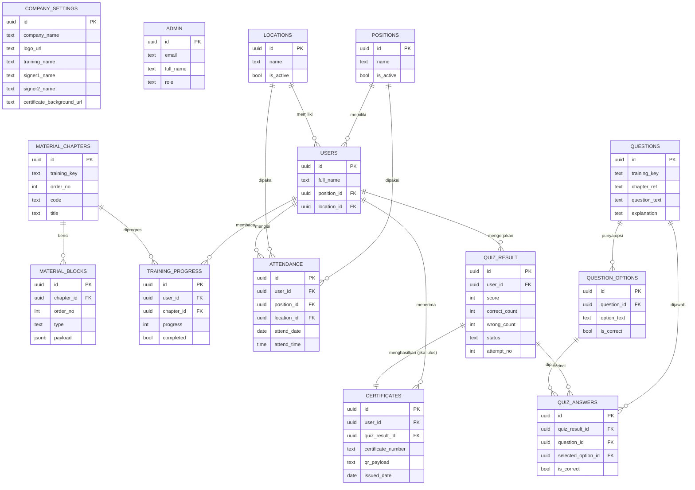

# 06 — Entity Relationship Diagram (ERD)

ERD menggambarkan relasi antar entitas database (lihat [05-database-design.md](05-database-design.md) untuk detail kolom).

## 1. Diagram (Mermaid)

## 2. Ringkasan Relasi

| Relasi | Kardinalitas | Keterangan |
|--------|--------------|------------|
| positions → users | 1 : N | Satu jabatan untuk banyak peserta |
| locations → users | 1 : N | Satu lokasi untuk banyak peserta |
| users → attendance | 1 : N | Peserta bisa hadir di beberapa hari (unik per hari) |
| users → training_progress | 1 : N | Progres per bab |
| material_chapters → material_blocks | 1 : N | Bab berisi banyak blok konten |
| material_chapters → training_progress | 1 : N | Progres dilacak per bab |
| users → quiz_result | 1 : N | Beberapa percobaan (retry) |
| quiz_result → quiz_answers | 1 : N | Detail 10 jawaban per sesi |
| questions → question_options | 1 : N | Satu soal banyak opsi |
| questions → quiz_answers | 1 : N | Soal dijawab di banyak sesi |
| question_options → quiz_answers | 1 : N | Opsi yang dipilih peserta |
| quiz_result → certificates | 1 : 1 | Satu hasil lulus → satu sertifikat |
| users → certificates | 1 : N | Peserta bisa punya sertifikat dari beberapa training |

## 3. Entitas Independen (tanpa FK keluar)

- `company_settings` — singleton konfigurasi, dibaca semua halaman (relasi logis, bukan FK).
- `admin` — terhubung ke Supabase `auth.users` (di luar diagram aplikasi).

## 4. Catatan Integritas

- **Snapshot** pada `attendance` (nama) & `certificates` (nama/jabatan/lokasi/training) menjaga histori tetap valid meski master (`users`, `positions`, `locations`, `company_settings`) berubah.
- **Unique constraints** kunci: `attendance(user_id, attend_date)`, `training_progress(user_id, chapter_id)`, `certificates(certificate_number)`.
- **Multi-training** difasilitasi kolom `training_key` pada materi, soal, dan hasil — mendukung reusability.
