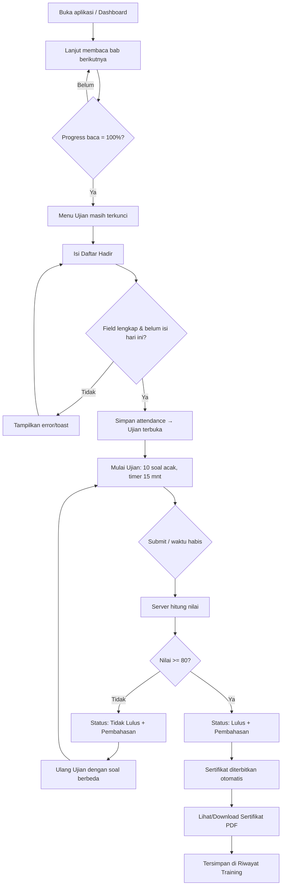
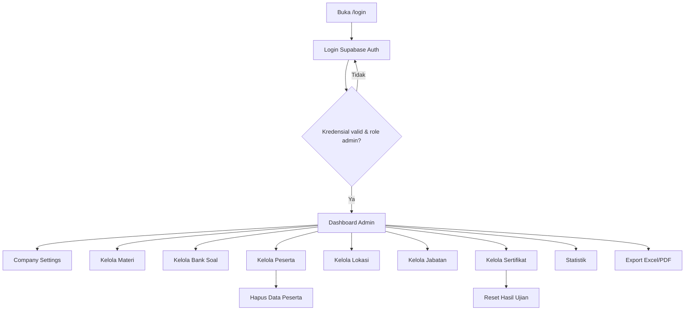
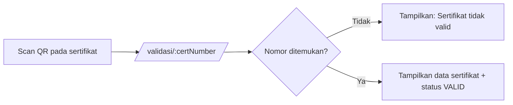

# 07 — User Flow

Alur pengguna untuk dua aktor: **Peserta** dan **Administrator**. Menggambarkan urutan langkah, keputusan, dan aturan gating (BR-xx dari [01](01-analisa-prd.md)).

## 1. Peserta — Alur Utama (Happy Path + Retry)



### Penjelasan Langkah
1. **Dashboard** — peserta melihat banner, statistik, dan timeline langkah.
2. **Materi** — membaca e-book; progres disimpan otomatis per bab. Ujian **terkunci** hingga 100% (BR-01).
3. **Daftar Hadir** — mengisi Nama, Jabatan, Lokasi (tanggal & jam otomatis). Validasi: field wajib & 1×/hari (BR-02, BR-03). Sukses → **Ujian terbuka**.
4. **Ujian** — 10 soal acak, opsi teracak, timer 15 menit (BR-09, BR-10).
5. **Hasil** — Nilai, benar/salah, status, pembahasan.
6. **Retry** — jika < 80, ulang dengan soal berbeda (BR-04).
7. **Sertifikat** — jika ≥ 80, terbit otomatis (nomor + QR + 2 TTD), download PDF (BR-05..08).
8. **Riwayat** — semua training, nilai, status, sertifikat.

## 2. Gating (Urutan Wajib)

```
Materi 100%  ──▶  Daftar Hadir (hari ini)  ──▶  Ujian  ──▶  Lulus  ──▶  Sertifikat
   (BR-01)            (BR-02, BR-03)         (BR-09/10)  (BR-05)     (BR-06/07/08)
```
Menu yang belum memenuhi syarat tampil **terkunci** dengan indikator & pesan alasan.

## 3. Administrator — Alur



### Penjelasan
- **Login** dengan autentikasi; hanya role Administrator.
- **Company Settings** — mengubah identitas & desain sertifikat; efek langsung ke seluruh halaman.
- **Kelola Materi/Bank Soal** — memperbarui konten training (mendukung ganti training).
- **Kelola Peserta/Lokasi/Jabatan/Sertifikat** — CRUD master & data.
- **Aksi khusus** — Hapus Data Peserta, Reset Hasil Ujian.
- **Export** — unduh Excel/PDF (Nama, Jabatan, Lokasi, Tanggal, Nilai, Status, Nomor Sertifikat).

## 4. Alur Validasi Sertifikat (Publik)



Halaman validasi bersifat **publik & read-only**, hanya menampilkan data keabsahan (nama, training, nomor, tanggal, nilai) dari `certificates`.

## 5. Kondisi Tepi (Edge Cases)

| Kondisi | Perlakuan |
|---------|-----------|
| Materi belum 100% tapi coba buka ujian | Blokir + pesan "Selesaikan materi dahulu" |
| Belum daftar hadir hari ini | Ujian tetap terkunci |
| Sudah daftar hadir hari ini, isi lagi | Tolak (unik user+tanggal) |
| Timer habis saat ujian | Auto-submit jawaban terisi |
| Nilai < 80 | Tawarkan ulang dengan set soal berbeda |
| Belum lulus tapi akses sertifikat | Tampilkan empty state "Belum tersedia" |
| Company Settings kosong | Halaman tampil placeholder netral, admin diminta melengkapi |
