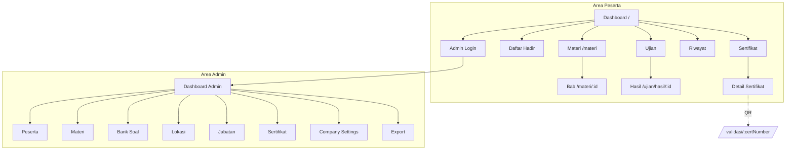

# 08 — Navigation Flow

Peta navigasi aplikasi: struktur menu, hubungan antar halaman, dan proteksi rute (route guard). Selaras dengan menu PRD dan folder pada [04](04-folder-structure.md).

## 1. Struktur Menu (PRD)

**Peserta:** Dashboard · Materi · Daftar Hadir · Ujian · Sertifikat · Riwayat Training · Admin Login
**Admin:** Dashboard Admin · Peserta · Materi · Bank Soal · Lokasi · Jabatan · Sertifikat · Company Settings · Export

## 2. Peta Rute (Sitemap)

```
PUBLIC (Peserta)
/                         Dashboard
/materi                   Daftar bab (e-book)
/materi/:chapterId        Detail bab
/daftar-hadir             Form daftar hadir            [gate: materi 100%]
/ujian                    Sesi ujian                   [gate: materi 100% + hadir hari ini]
/ujian/hasil/:resultId    Hasil & pembahasan
/sertifikat               Daftar sertifikat milik peserta
/sertifikat/:certId       Detail + download PDF        [gate: lulus]
/riwayat                  Riwayat training
/validasi/:certNumber     Validasi QR (publik)

ADMIN
/login                    Login admin
/admin                    Dashboard admin              [guard: auth]
/admin/peserta            Kelola peserta               [guard: auth]
/admin/materi             Kelola materi                [guard: auth]
/admin/bank-soal          Kelola bank soal             [guard: auth]
/admin/lokasi             Kelola lokasi                [guard: auth]
/admin/jabatan            Kelola jabatan               [guard: auth]
/admin/sertifikat         Kelola sertifikat            [guard: auth]
/admin/company-settings   Company Settings             [guard: auth]
/admin/export             Export Excel/PDF             [guard: auth]
```

## 3. Diagram Navigasi



## 4. Navigasi Bergantung Status (Peserta)

Item menu peserta menampilkan status **terkunci/terbuka**:

| Menu | Syarat Terbuka | Jika Belum |
|------|----------------|-----------|
| Materi | Selalu terbuka | — |
| Daftar Hadir | Materi 100% | Terkunci + "Selesaikan materi" |
| Ujian | Materi 100% + hadir hari ini | Terkunci + alasan |
| Sertifikat | Status lulus | Empty state |
| Riwayat | Selalu (menampilkan yang ada) | Empty state jika kosong |

Navigasi internal materi: **Previous / Next** antar bab, **Search** lompat ke bab/blok, **Bookmark** akses cepat.

## 5. Route Guard / Proteksi

| Area | Mekanisme |
|------|-----------|
| `/admin/*` | Guard di `(admin)/layout.tsx`: cek sesi Supabase Auth + role. Tidak login → redirect `/login` |
| Gate peserta | Cek di layer fitur (progress, attendance, result) sebelum render halaman; redirect/kunci bila syarat belum terpenuhi |
| API server | Route Handler memverifikasi kondisi (mis. submit ujian hanya bila attendance ada) & role admin untuk export/kelola |
| Validasi publik | `/validasi/:certNumber` tanpa auth, read-only |

## 6. Elemen Layout Global

- **Navbar/Sidebar** peserta: menu utama + toggle **Dark Mode**.
- **Sidebar admin**: menu manajemen.
- **Footer**: identitas dari Company Settings (nama, alamat, kontak) — bukan hardcode.
- **Toast** global untuk feedback aksi; **Skeleton** saat loading; **Empty State** saat data kosong.

## 7. Prinsip Navigasi

- Konsisten: satu pola untuk area publik & admin.
- Aman: guard di layout + verifikasi ulang di server.
- Informatif: menu terkunci menjelaskan alasan & langkah berikutnya (dipandu timeline dashboard).
